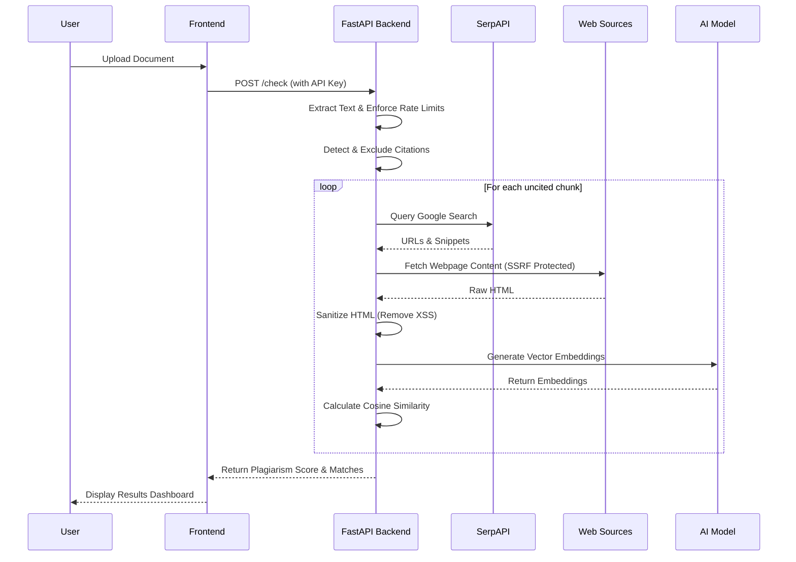
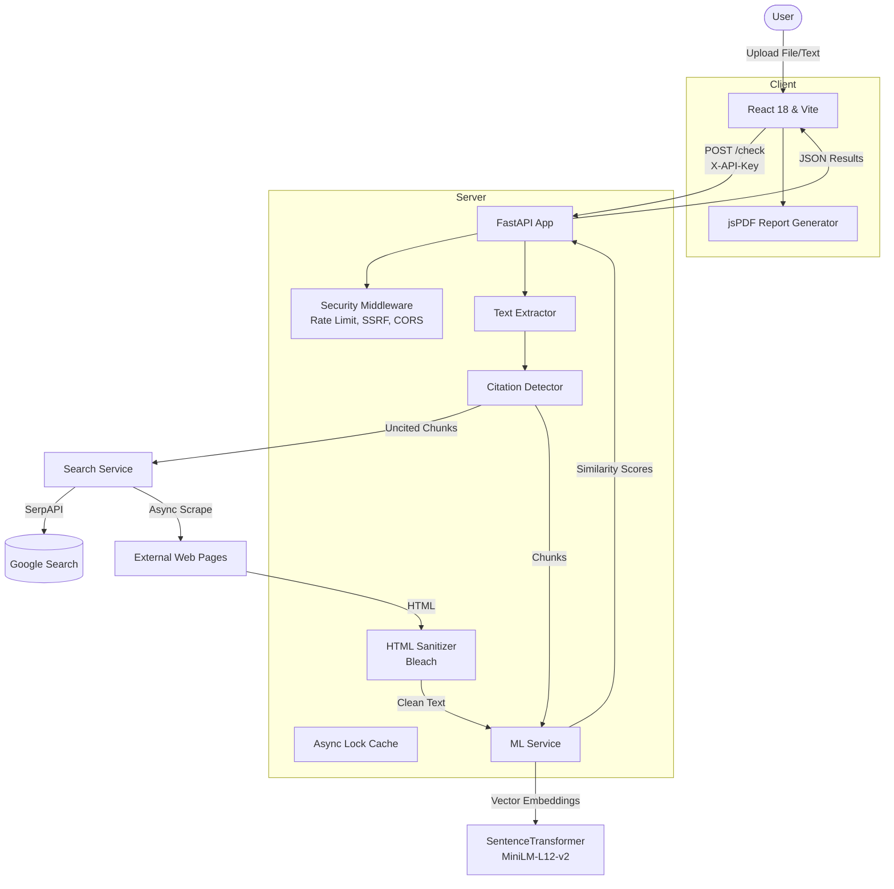

# 🧠 AI Plagiarism Checker

[](./LICENSE)
[](#-security-hardening)
[](https://reactjs.org/)
[](https://fastapi.tiangolo.com/)

A premium, high-accuracy plagiarism detection tool powered by advanced AI and semantic analysis. This application compares your text or PDF documents against millions of online sources to detect plagiarism with high precision while intelligently recognizing proper citations.

Recently completely overhauled, the system is now **production-ready**, featuring a **Secure-by-Design architecture** that protects against common web vulnerabilities, making it safe for deployment in academic and enterprise environments.

---

## ✨ Key Features

### 🚀 Advanced AI Detection

- **Semantic Similarity**: Uses `SentenceTransformer` (`paraphrase-multilingual-MiniLM-L12-v2`) to detect paraphrased content, not just exact word matches.
- **Multilingual Support**: Effectively analyzes text in over 50+ languages.

### 🛡️ Secure by Design

- **API Key Authentication**: Protects the backend from unauthorized access.
- **Rate Limiting**: Defends against DDoS and quota exhaustion via `slowapi` (IP-based limits).
- **SSRF Protection**: Blocks internal/private IP resolution and malicious cloud metadata access.
- **Input Validation & Sanitization**: Strict file size limits, regex ReDoS protection, and server-side HTML stripping (XSS prevention).

### 🎓 Smart Citation Detection

- Automatically identifies academic citations (APA, MLA, IEEE, Chicago, etc.).
- **Excludes cited content** from plagiarism scores.
- Provides specific recommendations (e.g., "Add citation" vs. "Rewrite").

### 🔄 Flexible Scan Modes

- **Quick Scan**: Fast analysis of up to 15 chunks (~10,500 chars). Ideal for quick checks.
- **Deep Scan**: Comprehensive analysis of the entire document.

### 📂 Multi-Format Support

- Drag and drop PDF, DOCX, or TXT files for instant analysis.
- Supports raw text pasting up to 50,000 characters.

### ⚡ Production-Ready Performance

- Async/await processing for 10x faster analysis.
- Parallel chunk processing with concurrency control.
- Smart deduplication and filtering (>30% similarity threshold).

### 🎨 Premium UI & Reporting

- Glassmorphism design with vibrant gradients and dark mode.
- **Real-time connection indicator** to check backend status.
- **Citation Badges** & Status Labels.
- Visual plagiarism score ring.
- **Client-side PDF & TXT Reports** generation (via `jsPDF`).

---

## ⚙️ How it Works (Under the Hood)



1. **Input Processing**:

    - The backend accepts **PDF, DOCX, or TXT** files (or raw text).
    - It extracts text using `PyPDF2`, `python-docx`, or standard decoding, bounded by strict extraction limits to prevent Zip Bombs.
    - The text is split into fixed-size **chunks** (default ~700 chars) to ensure granular analysis.

2. **Citation Analysis**:

    - Before checking for plagiarism, each chunk is scanned for **citations** using optimized, ReDoS-safe regex patterns.
    - If a valid citation is found, the chunk is marked as **"Properly Cited"** and excluded from the plagiarism score.

3. **Smart Search (SerpAPI)**:

    - Uncited chunks are sent to **Google Search** via SerpAPI to find potential source matches.
    - The system fetches the content of the top search results using **browser-mimicking headers** and **robust compression handling** (Brotli).
    - Web scraping is protected by robust SSRF checks and strict TLS certificate enforcement.

4. **Semantic Comparison**:

    - The user's text and the fetched source text are converted into vector embeddings.
    - Cosine similarity is calculated to determine how closely the texts match.

5. **Scoring & Reporting**:

    - **Plagiarism Score** = (Plagiarized Chunks / Total Chunks) \* 100.
    - Matches are categorized as **High Risk** (>60% similarity) or **Potential Plagiarism** (>30% similarity).
    - HTML returned to the frontend is aggressively sanitized server-side.

---

## 🛠️ Tech Stack & Architecture



### ⚙️ Backend (Python / FastAPI)

- **FastAPI**: High-performance async web framework.
- **Security Modules**: `slowapi` (Rate Limiting), `bleach` (Sanitization), Custom Middleware for Security Headers & Audit Logging.
- **Machine Learning**: `sentence-transformers` for creating vector embeddings.
- **Document Parsing**: `PyPDF2` and `python-docx`.
- **Async I/O**: `aiohttp` for parallel web requests and `BeautifulSoup4` for HTML cleaning.

### 🎨 Frontend (React / Vite)

- **React 18**: Component-based UI library.
- **Vite**: Next-generation frontend tooling for blazing fast builds.
- **Styling**: Vanilla CSS3 Variables utilizing a Glassmorphism design system.
- **PDF Generation**: `jsPDF` for client-side report generation.

---

## 📁 Project Structure

```text
plagiarism-checker/
├── backend/               # FastAPI backend server
│   ├── main.py            # Main application file & orchestrator
│   ├── config.py          # Environment & limits config
│   ├── security/          # Security-specific logic (Auth, SSRF, Rate Limits)
│   ├── services/          # Business logic (Citation, Search, Extractor)
│   ├── middleware/        # Custom ASGI Middleware (Logging, Headers)
│   ├── requirements.txt   # Pinned Python dependencies
│   └── .env               # Backend environment variables
├── frontend/              # React frontend (current version)
│   ├── src/               # React components, styles, and logic
│   ├── .env               # Frontend environment variables
│   └── package.json       # Node dependencies
├── frontend_legacy/       # Legacy HTML/CSS/JS frontend (deprecated)
├── Upgrade/               # Threat Modeling & Security Checklists
├── DEPLOYMENT.md          # Deployment guide
└── README.md              # This file
```

---

## 🚀 Getting Started

### 📋 Prerequisites

- **Python 3.8+**
- **Node.js & npm** (for the frontend)
- A **[SerpAPI](https://serpapi.com/)** API Key (for web search functionality).

### 📦 Installation

1. **Clone the repository**

   ```bash
   git clone https://github.com/Ayaan-22/PlagiarismAI.git
   cd plagiarism-checker
   ```

2. **Backend Setup**

   Navigate to the backend directory and install dependencies:

   ```bash
   cd backend
   pip install -r requirements.txt
   ```

3. **Frontend Setup**

   Navigate to the frontend directory and install dependencies:

   ```bash
   cd frontend
   npm install
   ```

### 🔐 Environment Configuration

**Backend (`backend/.env`):**

Create a `.env` file in the `backend` directory.

```env
# Your SerpAPI Key
SERPAPI_KEY=your_serpapi_key_here

# Comma-separated list of valid API keys for backend access
API_KEYS=your-secure-api-key-1,your-secure-api-key-2

# Allowed origins for CORS
ALLOWED_ORIGINS=http://localhost:5173,http://127.0.0.1:5173
```

**Frontend (`frontend/.env`):**

Copy the example environment file and configure it.

```bash
cd frontend
cp .env.example .env
```

Update it to include your backend URL and the API key you configured above:

```env
VITE_API_BASE_URL=http://127.0.0.1:9002
VITE_API_KEY=your-secure-api-key-1
```

---

## ▶️ Running the Application

1. **Start the Backend Server**

   ```bash
   cd backend
   uvicorn main:app --host 127.0.0.1 --port 9002 --reload
   ```

   The server will start at `http://127.0.0.1:9002`.

2. **Launch the Frontend**

   ```bash
   cd frontend
   npm run dev
   ```

   Open the displayed URL (typically `http://localhost:5173`) in your browser.

---

## 📖 Usage Guide

1. **Check Connection**: Look at the top-right corner of the UI for the connection status indicator (🟢 Green = Connected).
2. **Select Input Method**: Choose "Upload File" (PDF, DOCX, TXT) or "Paste Text".
3. **Choose Scan Mode**:

   - **Quick Scan**: Best for rapid checks; limits processing to the first 15 chunks.
   - **Deep Scan**: Thorough analysis of the entire document (subject to stricter rate limits).

4. **Analyze**: Click **Analyze Content**.
5. **View Results**:

   - **Plagiarism Score**: The overall percentage of content matching external sources (excluding valid citations).
   - **Cited Chunks**: Review which parts of your text were correctly identified as academic citations.
   - **Matches**: Review specific matches with similarity scores, external source links, and AI recommendations.
   - **Download Report**: Click to save a generated PDF or TXT summary of the analysis.

---

## 🔒 Security Hardening

This application underwent a comprehensive Threat Modeling process (STRIDE/DREAD/PASTA). The following critical security features have been implemented to ensure production readiness:

- **Authentication & Access Control**: All API endpoints are protected by an `X-API-Key` dependency.
- **SSRF Protection**: Outbound requests perform DNS resolution to block DNS rebinding, internal/loopback IPs, and cloud metadata endpoints (e.g., AWS `169.254.169.254`).
- **Rate Limiting**: Integrated `slowapi` enforces strict IP-based limits (e.g., 5 req/min for Quick Scans, 1 req/min for Deep Scans) to prevent API quota exhaustion.
- **Data Sanitization & XSS Prevention**: All scraped HTML content is stripped server-side using `bleach` before reaching the frontend.
- **Zip Bomb Prevention**: Strict limits on uploaded file sizes and post-extraction text bounds.
- **Concurrency Safety**: Shared in-memory caches are protected by `asyncio.Lock` to prevent race conditions.

For full details, please refer to the Threat Model and Implementation Checklist located in the `Upgrade/` directory.

---

## 🚀 Deployment

Want to take this project live? Check out our detailed **[Deployment Guide](DEPLOYMENT.md)** for step-by-step instructions on how to deploy to Render (Free Tier) or use Docker.

---

## 📝 Note on Frontend Versions

This project includes two frontend implementations:

- **`frontend/`** (Recommended) - Modern React-based frontend with component architecture, better performance, and maintainability.
- **`frontend_legacy/`** (Deprecated) - Original HTML/CSS/JavaScript implementation. Kept for reference but not actively maintained.

**We strongly recommend using the React frontend** (`frontend/`) for all new development and deployments.

---

## 🤝 Contributing

Contributions are always welcome! Please feel free to submit a Pull Request or open an issue if you discover a bug or have a feature request.

## 📄 License

This project is licensed under the MIT License.
